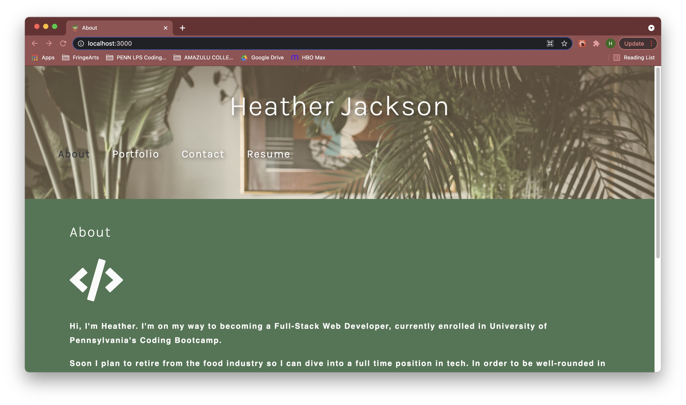
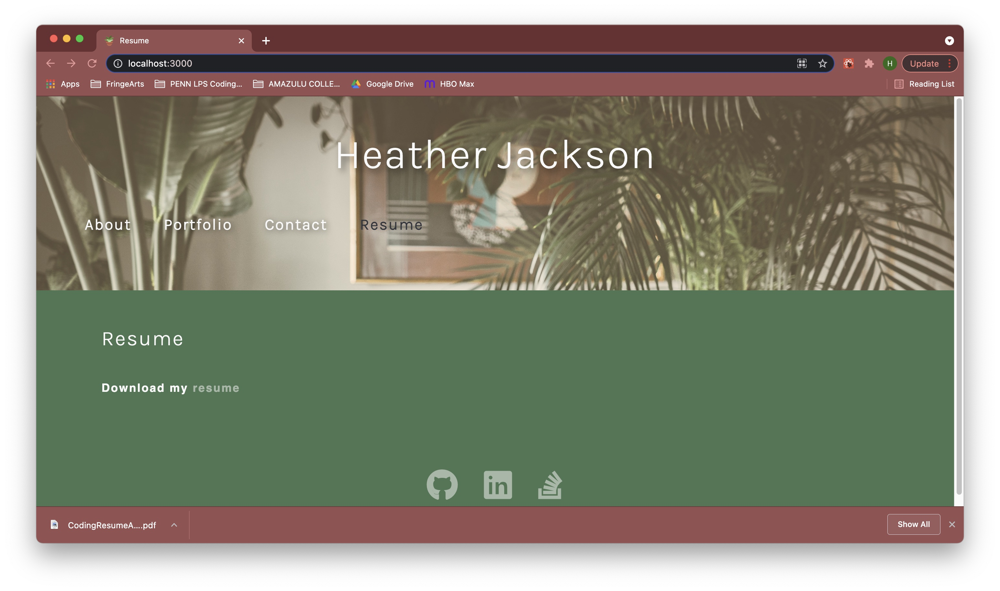

# ReactPortfolio
Professional Portfolio of my Full-Stack Web Development related work using React.js

## Description
This application is a React.js webpage displaying professional information about myself and work in Web Development. Please check it out using the link below to learn more about me and see a variety of Full Stack applications I have built throughout my journey at The Unniversity of Pennsylvania's Coding Bootcamp. This portfolio is here for friends, family, and coworkers to see what I have accomplished thus far as a Web Developer, but more importantly it is a professional portfolio for potential employers and business partners.

## Installation
This application does not require any installation and can be accessed here: [Heather Jackson, Web Developer]()

## Usage
Below are screenshots of the site.

## Credits
Thank you to Penn LPS Coding Bootcamp, instructors, peers, [JavaScript](https://www.javascript.com/), and [React.js](https://reactjs.org/).

## License

## How to Contribute

Contact me @heatherloisejackson on GitHub
